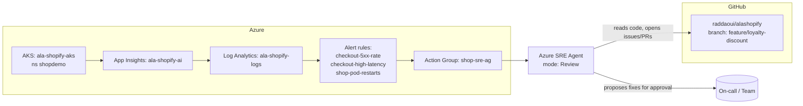

# Azure SRE Agent — Setup & Operations Guide

A step-by-step guide to standing up the **Azure SRE Agent** for the *alashopify*
shop demo: creating the agent in the portal, connecting Azure resources and
source code, onboarding the team, scheduling tasks, and handling an incident.

The agent is set up in **Review mode** (every action needs human approval). Each
section calls out **when and what** you can safely promote to **Autonomous mode**.

> Azure SRE Agent is a preview service. Exact portal labels and available
> regions may change. Where a label may differ, the intent is described so you
> can find the equivalent control.

---

## 0. What you're building



The SRE Agent watches the app's signals (metrics, logs, alerts), investigates
incidents, correlates them with the source code, and **proposes** remediation.
In Review mode a human approves every action; in Autonomous mode the agent can
execute a pre-approved set of action types on its own.

---

## 1. Prerequisites

| Requirement | This demo's value |
|---|---|
| Azure subscription with the SRE Agent preview enabled | *your subscription* |
| Resource group holding the workload | `ala-shopify-rg` (region `westus3`) |
| AKS cluster running the app | `ala-shopify-aks`, namespace `shopdemo` |
| Telemetry: App Insights + Log Analytics | `ala-shopify-ai`, `ala-shopify-logs` |
| Azure Monitor alert rules + action group | `shop-sre-ag` + 3 rules (see §9) |
| Source repo on GitHub | `https://github.com/raddaoui/alashopify` |
| Permissions to grant RBAC roles | **Owner** or **User Access Administrator** on the RG/subscription |
| Microsoft Entra account for each operator | one per team member |

Roles you'll need to *grant* the agent are covered in §3. Roles **you** need to
*do this setup* are Owner / User Access Administrator on `ala-shopify-rg`.

---

## 2. Create the SRE Agent (Azure portal)

1. Sign in to the [Azure portal](https://portal.azure.com).
2. In the global search bar, type **SRE Agent** and select **Azure SRE Agent**.
3. Click **Create**.
4. On the **Basics** tab:
   - **Subscription** — the subscription containing `ala-shopify-rg`.
   - **Resource group** — `ala-shopify-rg` (or a dedicated management RG; the
     agent can monitor across RGs once you grant it access in §3).
   - **Name** — `alashopify-sre-agent`.
   - **Region** — choose a region where the preview is available (co-locating
     with `westus3` keeps latency and data residency simple).
5. **Review + create** → **Create**. When deployment finishes, click
   **Go to resource** — the agent opens the **Setup** screen, which continues in
   §3.

---

## 3. Connect resources (agent setup)

After **Go to resource**, the agent's **Setup** screen lets you choose how much
context to connect:

- **Quickstart** — minimal onboarding for a fast trial.
- **Full setup** — recommended for real investigations (adds more context).

Choose **Full setup**, then connect the sources below. Once setup is done, set
the agent to **Review mode** before doing anything else (see §7).

### 3a. Connect code

Connect your source code repository — **GitHub** or **Azure Repos** — so the
agent can correlate incidents with commits/branches and draft fixes. In the
setup → **Code**, pick your provider, authorize access, and select the
`alashopify` repository.

### 3b. Connect the incident management platform

Connect your incident/alerting source so fired alerts reach the agent:

1. In the setup → **Incidents** (incident management platform).
2. Connect **Azure Monitor alerts** → select the action group `shop-sre-ag`
   (this is how fired alerts reach the agent — see §9).
3. (Optional) Connect an external platform (e.g. PagerDuty/ServiceNow) if that's
   where your on-call incidents originate.

### 3c. Connect Azure resources (read access)

This is where you grant the agent access to your Azure resources and **specify
read-only (Reader)** access for Review mode.

1. In the setup → **Azure resources** → **Add resource groups**.
2. **Select resource groups** → choose `ala-shopify-rg` (the agent can monitor
   across RGs once added).
3. **View agent permissions** → set **Permission level** to:
   - **Reader** — *read-only access. Agent can view resources and metrics but
     cannot make changes.* **Choose this for Review mode.**
   - **Privileged** — read **and** write access (diagnose + perform
     remediation). Don't choose this yet — see §7.
4. The wizard lists the **roles to be granted** for the level you picked
   (e.g. Reader, Monitoring Reader, Log Analytics Reader). Required roles are
   **granted automatically** when you add the resource group — you don't assign
   them manually.
5. Click **Add resource group**.

### 3d. Connect the telemetry sources

In the agent resource → **Connections** (or **Data sources**):

1. **Add** → **Application Insights** → select `ala-shopify-ai`.
2. **Add** → **Log Analytics workspace** → select `ala-shopify-logs`.
3. **Add** → **Azure Kubernetes Service** → select `ala-shopify-aks`, namespace
   `shopdemo`.

Once everything is connected, click **Done** and go to the agent to start the
team onboarding (§4).

---

## 4. Team onboarding

Team onboarding teaches the agent about **your team**, **your procedures**, and
**your code**. When you selected **Done and go to agent** at the end of §3, the
agent opens the **Team onboarding** thread — a pinned conversation in your
**Favorites** sidebar — and starts building knowledge from everything you
connected.

> You can onboard even if you skipped some connections in §3 — the agent works
> without connected data sources, but the interview is richer when it can read
> your code and Azure resources.

### 4a. The agent learns from your connected context

As soon as the thread opens, the agent explores what you connected in §3 — you
don't need to do anything. A progress indicator shows while it works, and you can
chat in the meantime.

- **Your codebase** — it reads the `alashopify` repo: README, directory
  structure, frameworks, and dependencies, then shows a summary.
- **Your Azure resources** — it explores `ala-shopify-rg`: lists services
  (`ala-shopify-aks`, `ala-shopify-ai`, `ala-shopify-logs`), resource types, and
  configurations.

If something's missing, just tell it in chat, e.g.:

> "The checkout flow runs in the `orders` deployment in the `shopdemo`
> namespace, and it talks to a MySQL StatefulSet for order persistence."

The agent updates its memory.

### 4b. Tell the agent about your team

The agent opens with a greeting, summarizes what it already found in your
subscription, and asks an opening question — typically **what your role is and
what the service actually does**. Answer naturally; it extracts the details. For
this demo, reply with something like:

> "We're the SRE team for the **alashopify** app — an e-commerce app running in
> AKS (`ala-shopify-aks`, namespace `shopdemo`). We own the whole app and all of
> its microservices. On-call is a weekly rotation, alerts come from Azure Monitor
> via the `shop-sre-ag` action group, and escalation goes to the senior on-call,
> then the team lead."

The agent confirms and saves this to memory (team name, services owned, on-call
rotation, escalation path).

> **Expect follow-up questions.** Onboarding is a conversation, not a single
> form. After it maps your repo, cluster, and Azure resources, the agent will ask
> further questions about your team and your troubleshooting habits — answer them
> as best you can so its memory is accurate. For example, after we shared the team
> info above, the agent summarized what it had captured (all 5 components, the
> checkout critical path, the observability stack, the 3 alert rules, CI/CD and
> deploy annotations, correlation via `operation_Id` / `cloud_RoleName`, current
> healthy state) and then asked:
>
> 1. *"Are there other team members I should know about — who are the senior
>    on-call and team lead, and do they have specific areas of expertise?"*
> 2. *"When something breaks at 2 AM, what's the first thing you personally check
>    — App Insights traces, or `kubectl get pods`?"*
>
> Answer these naturally; the agent folds your replies into its persistent memory.
> For this demo you could answer:
>
> - *Team members:* "Besides me, the senior on-call is the AKS/networking expert
>   and the team lead owns the MySQL/data layer and approves risky changes."
> - *2 AM triage:* "We start with the fired **alert** to see what tripped. If it's
>   **latency**, we look at **metrics** and the App Insights dependency spans to
>   find the slow hop. If it's **error codes / 5xx**, we go to the **code** and the
>   running pods (`kubectl get pods`, `kubectl logs`, `kubectl describe`) and query
>   **Log Analytics** for the exceptions. **App Insights** is always our most
>   helpful starting point for tracing a request end-to-end."

### 4c. Share your procedures and knowledge

If you have any **design docs, troubleshooting docs, or wikis**, you can upload
them here so the agent learns your procedures — select the **+** in the chat
input → **Attach file** → choose a Markdown, PDF, or text file.

> **For this demo you can skip the upload.** Our docs (including
> `docs/TROUBLESHOOTING.md`) already live in the **code repo we attached in
> §3a** (`raddaoui/alashopify`), so the agent reads them automatically — there's
> no need to re-upload them.

If your docs *aren't* in the repo, you can also just describe a procedure in
chat, e.g.:

> "When checkout latency spikes, first check the App Insights dependency span
> for the MySQL query, then verify the `orders` deployment's recent
> image/commit, then check pod restarts in `shopdemo`."

The agent extracts the steps and saves them to persistent memory.

### 4d. Ask the agent what to do next

After onboarding, ask **"What should I do next?"** The agent gives prioritized
recommendations based on what you've connected and what's still missing (e.g.
connect more data sources, upload more runbooks, set up incident response).

### 4e. What the agent remembers

Onboarding produces persistent memory files the agent consults during every
investigation:

| File | Contents | Source |
|---|---|---|
| `architecture.md` | Repo structure, frameworks, service dependencies, key code paths | Codebase exploration (§4a) |
| `team.md` | Team name, size, services owned, on-call rotation, escalation paths | Team interview (§4b) |
| `debugging.md` | Troubleshooting procedures, runbook steps, known issues | Knowledge sharing (§4c) |

These persist across sessions — you don't need to re-explain your team or
procedures.

---

## 5. Complete your setup (get every checkmark green)

Return to the **setup page** (select **Complete setup** in the status bar) and
connect any remaining sources so the progress bar is full. For alashopify:

- [x] **Code** — `raddaoui/alashopify` (§3a).
- [ ] **Logs** — connect the **Logs** card to `ala-shopify-logs` so the agent can
      query exceptions and traces.
- [ ] **Deployments** — connect the **GitHub Actions** pipeline to correlate
      incidents with the latest image/commit.
- [x] **Incidents** — Azure Monitor / `shop-sre-ag` (§3b).
- [x] **Azure resources** — `ala-shopify-rg` (§3c).
- [x] **Knowledge files** — our docs live in the connected repo (§4c), no upload
      needed.

> Tip: your **Team onboarding** thread stays in the **Favorites** sidebar — open
> it anytime, or type `/learn` to restart the interview.

---

## 6. Your first investigation — introduce the fault

To see the agent detect, investigate, and propose a fix end-to-end, deploy a
faulty feature and let the alerts fire.

The branch
[raddaoui/alashopify @ feature/loyalty-discount](https://github.com/raddaoui/alashopify/tree/feature/loyalty-discount)
adds a loyalty feature that calculates discounted prices based on how many orders
a user has placed. It introduces **two faults on checkout**:

1. **Latency** — `_loyalty_discount()` runs `SELECT COUNT(*) ... SLEEP(0.6) FROM
   orders` on every order, adding ~600 ms (trips the `checkout-high-latency`
   p95 alert).
2. **Intermittent 500s** — `_loyalty_tier()` can return `"platinum"`, but
   `LOYALTY_RATES` only has bronze/silver/gold, so `LOYALTY_RATES[tier]` throws
   `KeyError` for users with 15+ orders (trips the `checkout-5xx-rate` alert).

**Deploy it to prod to introduce the issues:**

1. Switch to the `feature/loyalty-discount` branch.
2. Roll it out to AKS — either **push a commit** to the branch, or manually run
   the **Build and deploy to AKS** workflow (GitHub Actions) with
   `feature/loyalty-discount` selected.
3. The workflow builds and tags the images and rolls them out to `shopdemo` on
   `ala-shopify-aks`.

**Confirm the faulty build is live:**

```bash
kubectl get deploy orders -n shopdemo \
  -o jsonpath='{.metadata.annotations.sre-demo\.deploy/branch}{"  "}{.metadata.annotations.sre-demo\.deploy/commit}{"\n"}'
# expect: feature/loyalty-discount  <sha>
```

**Generate load so the faults surface:**

Drive realistic traffic against the site — either click around the app manually,
or run the load-test script
([scripts/loadtest.sh](https://github.com/raddaoui/alashopify/blob/main/scripts/loadtest.sh)),
which sends requests across different paths:

```bash
GATEWAY_IP=$(kubectl get svc gateway -n shopdemo \
  -o jsonpath='{.status.loadBalancer.ingress[0].ip}')

# download the load-test script, make it executable, and run it
curl -sSLO https://raw.githubusercontent.com/raddaoui/alashopify/main/scripts/loadtest.sh
chmod +x loadtest.sh

# usage: loadtest.sh <url> <duration_secs> <concurrency>
./loadtest.sh http://$GATEWAY_IP 60 10
```

Then wait a couple of minutes for the alert evaluation windows to roll up.

**Confirm both faults landed:**

1. **Latency (~600 ms) on checkout**

   ```bash
   for i in $(seq 1 20); do
     time curl -s -o /dev/null -w "%{http_code}\n" \
       -X POST "http://$GATEWAY_IP/api/checkout" \
       -H "Content-Type: application/json" \
       -d '{"user_id":1,"items":[{"product_id":1,"quantity":1}]}'
   done
   # expect: real ~0.6s+ on every call
   ```

2. **Intermittent 500** — hit a user with ≥15 orders (tier `platinum` → `KeyError`)

   ```bash
curl -s -w "\nHTTP Status: %{http_code}\n" \
  -X POST "http://$GATEWAY_IP/api/checkout" \
  -H "Content-Type: application/json" \
  -d '{"user_id":1,"items":[{"product_id":1,"quantity":25}]}'
   ```

3. **Orders logs** — see the `KeyError` stack trace

   ```bash
   kubectl logs -n shopdemo deploy/orders --tail=200 | grep -iEC5 "error|exception|KeyError|traceback"
   ```

4. **App Insights** (KQL — Logs blade)

   ```kusto
   // latency + failures on checkout/orders
   requests
   | where timestamp > ago(30m)
   | where name has "checkout" or name has "/orders"
   | summarize p95=percentile(duration,95), failures=countif(success==false), count() by bin(timestamp,1m)
   | order by timestamp desc

   // the SLEEP-bound DB dependency span
   dependencies
   | where timestamp > ago(30m) and type == "mysql"
   | summarize p95=percentile(duration,95), count() by name
   | order by p95 desc

   // the KeyError exceptions
   exceptions
    | where timestamp > ago(30m)
    | where cloud_RoleName contains "orders"
    | project timestamp, type, outerMessage, details, operation_Id
   ```

5. **Alerts fired** — Portal → **Monitor → Alerts** (or
   `az monitor scheduled-query list -g ala-shopify-rg -o table`):
   `checkout-high-latency` (Sev2) and `checkout-5xx-rate` (Sev1) should be active.

> Quick mental check: step 1 = latency fault (`SLEEP(0.6)`), steps 2–3 = 500
> fault (missing `platinum` rate). If the alert thresholds don't trip, run
> `./loadtest.sh` again for sustained load.

**Ask the agent to investigate:**

Now that you've manually confirmed the faults, hand them to the agent and watch
it diagnose the root cause from your code, Azure resources, and the knowledge
files it built during onboarding.

1. In the agent, select **New chat thread** (left sidebar).
2. Describe the problem — be specific about the service and resource group. For
   example:

   > "Checkout on alashopify is slow and intermittently returning 500s. The
   > `orders` service in resource group `ala-shopify-rg` (namespace `shopdemo`
   > on `ala-shopify-aks`) started misbehaving after a recent deploy. Checkout
   > p95 latency is ~600 ms and some requests fail with a 500. Can you
   > investigate the root cause and recommend a fix?"

3. Select **Send**.

Watch the agent work through its plan in real time:

- **Read context** — reads `architecture.md`, `team.md`, and `debugging.md` from
  the connected repo to orient itself.
- **Explore code** — traces checkout/orders code paths and finds the
  loyalty-discount changes (`_loyalty_discount()` and `_loyalty_tier()`).
- **Query Azure resources** — runs read-only `kubectl`/CLI and KQL to inspect
  pod state, recent deploy, latency, and the `KeyError` exceptions.
- **Deliver the diagnosis** — root cause with file/line references, evidence
  (log snippets + metrics), and a recommended fix (the slow `SLEEP(0.6)` query
  and the missing `platinum` entry in `LOYALTY_RATES`).

> Tip: you can also point it straight at a symptom, e.g. *"We're seeing 5xx
> errors on checkout — can you investigate?"* or *"What recent changes were
> deployed to the orders service?"*

> **Heads-up:** the alerts now exist, but the agent won't act on them on its own
> yet — you still need to wire up automated incident response so fired alerts are
> handed off to the agent. That's the next step (§7).

---

## 7. Operating modes — Review vs Autonomous

| | **Review mode** (start here) | **Autonomous mode** (promote later) |
|---|---|---|
| Investigation (read logs, metrics, run read-only `kubectl`, query KQL) | ✅ automatic | ✅ automatic |
| Root-cause analysis & written summary | ✅ automatic | ✅ automatic |
| Drafting an issue / fix PR | ✅ draft only | ✅ may open PR automatically |
| Remediation (restart, scale, roll back image) | ⛔ **requires human approval** | ✅ executes pre-approved action types |
| Destructive ops (delete, DB change, scale-to-zero) | ⛔ approval (consider 2) | ⛔ keep manual even in autonomous |

### When to promote an action type to Autonomous

Promote **one narrow action type at a time**, only after it clears this bar:

1. The agent has proposed that action **correctly several times** in Review mode
   (no false root causes, correct target resource).
2. The action is **low-blast-radius and reversible** (e.g. *restart a single
   deployment in `shopdemo`*, *scale a stateless deployment within set bounds*).
3. You've set **guardrails**: max replicas, allowed namespaces (`shopdemo` only),
   rate limits (e.g. no more than 1 auto-restart per 10 min), and a kill switch.
4. There's an **audit trail + rollback** path you've tested.

**Safe-to-automate examples (this demo):**
- Restart a crash-looping pod in `shopdemo`.
- Scale the stateless `gateway`/`orders` deployments within `min=2,max=6`.
- Acknowledge a known, self-resolving alert.

**Keep in Review (never auto) — examples:**
- Rolling back to a different image/commit (changes what code is live).
- Anything touching the `mysql` StatefulSet or its PVC (data loss risk).
- Editing secrets, ConfigMaps, or network/ingress.
- Deleting any resource.

How to change it: Agent → **Settings** → **Mode**, or per-action under
**Policies → Autonomous actions** → enable the specific action type and set its
guardrails. You can revert to full Review at any time with the **kill switch**.

---

## 8. Scheduling a task

Use schedules for proactive checks (not just reactive alerts).

1. Agent → **Tasks** (or **Schedules**) → **New scheduled task**.
2. **Name** — `shopdemo-hourly-health`.
3. **Trigger** — recurrence, e.g. every **1 hour** (cron `0 * * * *`).
4. **Scope** — resource group `ala-shopify-rg`, namespace `shopdemo`.
5. **Instruction / prompt** — what you want it to do, e.g.:

   > "Check the health of the shopdemo namespace. Verify all deployments have
   > their desired replicas Ready, query App Insights for the checkout p95
   > latency and 5xx rate over the last hour, and confirm no pods restarted more
   > than 3 times. If everything is healthy, post a one-line green summary. If
   > not, open an incident, perform root-cause analysis, and **propose** (do not
   > execute) a remediation for approval."

6. **Mode for this task** — **Review** (propose only). Leave autonomous off.
7. **Notifications** — post results to the Teams incident channel.
8. **Save**.

Other useful schedules:
- `nightly-cost-and-drift` — daily: report deployment image/commit drift vs.
  `main` using the `sre-demo.deploy/commit` annotations.
- `pre-demo-readiness` — on-demand button you run before a demo.

> In Review mode a scheduled run that finds a problem will **propose** a fix and
> wait. Promote a schedule to autonomous only for the narrow, reversible actions
> in §7 (e.g. auto-restart a crash-looped pod found by the hourly check).

---

## 9. Handling an incident (end-to-end)

This walks through the demo's injected fault: the checkout path runs a slow DB
query and intermittently throws, producing ~600 ms latency and HTTP 500s.

### 9a. Trigger
One of the alert rules fires and notifies the `shop-sre-ag` action group:

| Alert rule | Condition | Severity |
|---|---|---|
| `checkout-5xx-rate` | checkout returns ≥ 5 HTTP 5xx in 5 min | Sev 1 |
| `checkout-high-latency` | checkout p95 > 800 ms | Sev 2 |
| `shop-pod-restarts` | a `shopdemo` pod restarts > 3× | Sev 2 |

The action group hands the alert to the SRE Agent, which **opens an incident**.

### 9b. What the agent does automatically (Review mode)
1. **Triages** the alert and assembles context: which service, since when, blast
   radius.
2. **Investigates** read-only:
   - Queries App Insights for the slow operation and the exception type.
   - Walks the distributed trace: request → `orders` → MySQL dependency span.
   - Runs read-only `kubectl` (`get pods`, `logs`, `describe`) in `shopdemo`.
3. **Correlates with code**: reads the `sre-demo.deploy/branch` +
   `sre-demo.deploy/commit` annotations on the `orders` deployment, maps them to
   the GitHub commit, and identifies the changed code on that branch.
4. **Writes a root-cause analysis** with evidence (timestamps, the dominant
   span, the failing query/exception, the suspect commit).

### 9c. What needs your approval (Review mode)
The agent **proposes** remediation and waits:
- *Immediate mitigation* — e.g. roll back `orders` to the last-known-good
  image/commit, **or** scale out to dilute impact.
- *Durable fix* — a **draft PR** against the suspect branch with the proposed
  code change and a written explanation.

You review the proposal, then **Approve** (agent executes the approved step) or
**Reject** (and optionally tell it what to do instead). Every step is logged.

### 9d. Verification & close
After an approved mitigation the agent re-checks the same signals (5xx rate, p95)
and confirms recovery, then summarizes the timeline and closes the incident.

### 9e. Where to watch it
- **Azure portal → Monitor → Alerts** — the fired alerts.
- **Agent → Incidents** — the live investigation timeline and proposed actions.
- **Teams incident channel** — proposals/approvals in-line.
- **GitHub** `raddaoui/alashopify` — any issue/PR the agent opened.

> **Could this incident be handled autonomously?** The *mitigation* (restart /
> scale within `shopdemo`) is a good autonomous candidate once proven (§7). The
> *rollback to a different commit* and the *code-fix PR merge* should stay in
> Review — they change what code runs in production.

---

## 10. Quick reference

| Item | Value |
|---|---|
| SRE Agent | `alashopify-sre-agent` (Review mode) |
| Resource group / region | `ala-shopify-rg` / `westus3` |
| AKS / namespace | `ala-shopify-aks` / `shopdemo` |
| App Insights | `ala-shopify-ai` |
| Log Analytics | `ala-shopify-logs` |
| Action group | `shop-sre-ag` |
| Alert rules | `checkout-5xx-rate`, `checkout-high-latency`, `shop-pod-restarts` |
| Source repo | `https://github.com/raddaoui/alashopify` |
| Deployed-build annotations | `sre-demo.deploy/branch`, `sre-demo.deploy/commit` |
| On-call group / approvers | `shop-oncall` / `shop-approvers` (Entra groups) |

### Mode summary
- **Default: Review mode** — agent investigates and proposes; humans approve all
  remediation.
- **Promote to Autonomous** only per narrow, reversible, guardrailed action type
  (e.g. restart/scale within `shopdemo`) after it's proven itself in Review.
- **Never autonomous:** rollbacks to a different commit, StatefulSet/DB/PVC
  changes, secret/config edits, deletes. Keep the kill switch handy.
