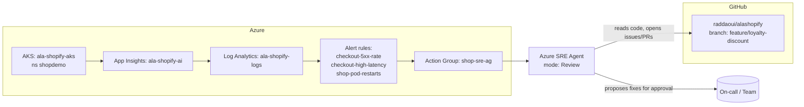

# Azure SRE Agent — Setup & Operations Guide

A step-by-step guide to standing up the **Azure SRE Agent** for the *alashopify*
shop demo: creating the agent in the portal, connecting Azure resources and
source code, onboarding the team, scheduling tasks, and handling an incident.

The agent is set up in **Review mode** (every action needs human approval). Each
section calls out **when and what** you can safely promote to **Autonomous mode**.

> Azure SRE Agent is a preview service. Exact portal labels and available
> regions may change. Where a label may differ, the intent is described so you
> can find the equivalent control.

---

## 0. What you're building



The SRE Agent watches the app's signals (metrics, logs, alerts), investigates
incidents, correlates them with the source code, and **proposes** remediation.
In Review mode a human approves every action; in Autonomous mode the agent can
execute a pre-approved set of action types on its own.

---

## 1. Prerequisites

| Requirement | This demo's value |
|---|---|
| Azure subscription with the SRE Agent preview enabled | *your subscription* |
| Resource group holding the workload | `ala-shopify-rg` (region `westus3`) |
| AKS cluster running the app | `ala-shopify-aks`, namespace `shopdemo` |
| Telemetry: App Insights + Log Analytics | `ala-shopify-ai`, `ala-shopify-logs` |
| Azure Monitor alert rules + action group | `shop-sre-ag` + 3 rules (`checkout-5xx-rate`, `checkout-high-latency`, `shop-pod-restarts`) |
| Source repo on GitHub | `https://github.com/raddaoui/alashopify` |
| Permissions to grant RBAC roles | **Owner** or **User Access Administrator** on the RG/subscription |
| Microsoft Entra account for each operator | one per team member |

Roles you'll need to *grant* the agent are covered in §3. Roles **you** need to
*do this setup* are Owner / User Access Administrator on `ala-shopify-rg`.

---

## 2. Create the SRE Agent (Azure portal)

1. Sign in to the [Azure portal](https://portal.azure.com).
2. In the global search bar, type **SRE Agent** and select **Azure SRE Agent**.
3. Click **Create**.
4. On the **Basics** tab:
   - **Subscription** — the subscription containing `ala-shopify-rg`.
   - **Resource group** — `ala-shopify-rg` (or a dedicated management RG; the
     agent can monitor across RGs once you grant it access in §3).
   - **Name** — `alashopify-sre-agent`.
   - **Region** — choose a region where the preview is available (co-locating
     with `westus3` keeps latency and data residency simple).
5. **Review + create** → **Create**. When deployment finishes, click
   **Go to resource** — the agent opens the **Setup** screen, which continues in
   §3.

---

## 3. Connect resources (agent setup)

After **Go to resource**, the agent's **Setup** screen lets you choose how much
context to connect:

- **Quickstart** — minimal onboarding for a fast trial.
- **Full setup** — recommended for real investigations (adds more context).

Choose **Full setup**, then connect the sources below. Once setup is done, set
the agent to **Review mode** before doing anything else (autonomy is configured
per response plan in §7 and per task in §8).

### 3a. Connect code

Connect your source code repository — **GitHub** or **Azure Repos** — so the
agent can correlate incidents with commits/branches and draft fixes. In the
setup → **Code**, pick your provider, authorize access, and select the
`alashopify` repository.

### 3b. Connect the incident management platform

Connect your incident/alerting source so fired alerts reach the agent:

1. In the setup → **Incidents** (incident management platform).
2. Connect **Azure Monitor alerts** → select the action group `shop-sre-ag`
   (this is how fired alerts reach the agent — see §7).
3. (Optional) Connect an external platform (e.g. PagerDuty/ServiceNow) if that's
   where your on-call incidents originate.

### 3c. Connect Azure resources (read access)

This is where you grant the agent access to your Azure resources and **specify
read-only (Reader)** access for Review mode.

1. In the setup → **Azure resources** → **Add resource groups**.
2. **Select resource groups** → choose `ala-shopify-rg` (the agent can monitor
   across RGs once added).
3. **View agent permissions** → set **Permission level** to:
   - **Reader** — *read-only access. Agent can view resources and metrics but
     cannot make changes.* **Choose this for Review mode.**
   - **Privileged** — read **and** write access (diagnose + perform
     remediation). Don't choose this yet — see §9.
4. The wizard lists the **roles to be granted** for the level you picked
   (e.g. Reader, Monitoring Reader, Log Analytics Reader). Required roles are
   **granted automatically** when you add the resource group — you don't assign
   them manually.
5. Click **Add resource group**.

### 3d. Connect the telemetry sources

In the agent resource → **Connections** (or **Data sources**):

1. **Add** → **Application Insights** → select `ala-shopify-ai`.
2. **Add** → **Log Analytics workspace** → select `ala-shopify-logs`.
3. **Add** → **Azure Kubernetes Service** → select `ala-shopify-aks`, namespace
   `shopdemo`.

Once everything is connected, click **Done** and go to the agent to start the
team onboarding (§4).

---

## 4. Team onboarding

Team onboarding teaches the agent about **your team**, **your procedures**, and
**your code**. When you selected **Done and go to agent** at the end of §3, the
agent opens the **Team onboarding** thread — a pinned conversation in your
**Favorites** sidebar — and starts building knowledge from everything you
connected.

> You can onboard even if you skipped some connections in §3 — the agent works
> without connected data sources, but the interview is richer when it can read
> your code and Azure resources.

### 4a. The agent learns from your connected context

As soon as the thread opens, the agent explores what you connected in §3 — you
don't need to do anything. A progress indicator shows while it works, and you can
chat in the meantime.

- **Your codebase** — it reads the `alashopify` repo: README, directory
  structure, frameworks, and dependencies, then shows a summary.
- **Your Azure resources** — it explores `ala-shopify-rg`: lists services
  (`ala-shopify-aks`, `ala-shopify-ai`, `ala-shopify-logs`), resource types, and
  configurations.

If something's missing, just tell it in chat, e.g.:

> "The checkout flow runs in the `orders` deployment in the `shopdemo`
> namespace, and it talks to a MySQL StatefulSet for order persistence."

The agent updates its memory.

### 4b. Tell the agent about your team

The agent opens with a greeting, summarizes what it already found in your
subscription, and asks an opening question — typically **what your role is and
what the service actually does**. Answer naturally; it extracts the details. For
this demo, reply with something like:

> "We're the SRE team for the **alashopify** app — an e-commerce app running in
> AKS (`ala-shopify-aks`, namespace `shopdemo`). We own the whole app and all of
> its microservices. On-call is a weekly rotation, alerts come from Azure Monitor
> via the `shop-sre-ag` action group, and escalation goes to the senior on-call,
> then the team lead."

The agent confirms and saves this to memory (team name, services owned, on-call
rotation, escalation path).

> **Expect follow-up questions.** Onboarding is a conversation, not a single
> form. After it maps your repo, cluster, and Azure resources, the agent will ask
> further questions about your team and your troubleshooting habits — answer them
> as best you can so its memory is accurate. For example, after we shared the team
> info above, the agent summarized what it had captured (all 5 components, the
> checkout critical path, the observability stack, the 3 alert rules, CI/CD and
> deploy annotations, correlation via `operation_Id` / `cloud_RoleName`, current
> healthy state) and then asked:
>
> 1. *"Are there other team members I should know about — who are the senior
>    on-call and team lead, and do they have specific areas of expertise?"*
> 2. *"When something breaks at 2 AM, what's the first thing you personally check
>    — App Insights traces, or `kubectl get pods`?"*
>
> Answer these naturally; the agent folds your replies into its persistent memory.
> For this demo you could answer:
>
> - *Team members:* "Besides me, the senior on-call is the AKS/networking expert
>   and the team lead owns the MySQL/data layer and approves risky changes."
> - *2 AM triage:* "We start with the fired **alert** to see what tripped. If it's
>   **latency**, we look at **metrics** and the App Insights dependency spans to
>   find the slow hop. If it's **error codes / 5xx**, we go to the **code** and the
>   running pods (`kubectl get pods`, `kubectl logs`, `kubectl describe`) and query
>   **Log Analytics** for the exceptions. **App Insights** is always our most
>   helpful starting point for tracing a request end-to-end."

### 4c. Share your procedures and knowledge

If you have any **design docs, troubleshooting docs, or wikis**, you can upload
them here so the agent learns your procedures — select the **+** in the chat
input → **Attach file** → choose a Markdown, PDF, or text file.

> **For this demo you can skip the upload.** Our docs (including
> `docs/TROUBLESHOOTING.md`) already live in the **code repo we attached in
> §3a** (`raddaoui/alashopify`), so the agent reads them automatically — there's
> no need to re-upload them.

If your docs *aren't* in the repo, you can also just describe a procedure in
chat, e.g.:

> "When checkout latency spikes, first check the App Insights dependency span
> for the MySQL query, then verify the `orders` deployment's recent
> image/commit, then check pod restarts in `shopdemo`."

The agent extracts the steps and saves them to persistent memory.

### 4d. Ask the agent what to do next

After onboarding, ask **"What should I do next?"** The agent gives prioritized
recommendations based on what you've connected and what's still missing (e.g.
connect more data sources, upload more runbooks, set up incident response).

### 4e. What the agent remembers

Onboarding produces persistent memory files the agent consults during every
investigation:

| File | Contents | Source |
|---|---|---|
| `architecture.md` | Repo structure, frameworks, service dependencies, key code paths | Codebase exploration (§4a) |
| `team.md` | Team name, size, services owned, on-call rotation, escalation paths | Team interview (§4b) |
| `debugging.md` | Troubleshooting procedures, runbook steps, known issues | Knowledge sharing (§4c) |

These persist across sessions — you don't need to re-explain your team or
procedures.

---

## 5. Complete your setup (get every checkmark green)

Return to the **setup page** (select **Complete setup** in the status bar) and
connect any remaining sources so the progress bar is full. For alashopify:

- [x] **Code** — `raddaoui/alashopify` (§3a).
- [ ] **Logs** — connect the **Logs** card to `ala-shopify-logs` so the agent can
      query exceptions and traces.
- [ ] **Deployments** — connect the **GitHub Actions** pipeline to correlate
      incidents with the latest image/commit.
- [x] **Incidents** — Azure Monitor / `shop-sre-ag` (§3b).
- [x] **Azure resources** — `ala-shopify-rg` (§3c).
- [x] **Knowledge files** — our docs live in the connected repo (§4c), no upload
      needed.

> Tip: your **Team onboarding** thread stays in the **Favorites** sidebar — open
> it anytime, or type `/learn` to restart the interview.

---

## 6. Your first investigation — introduce the fault

To see the agent investigate, and propose a fix end-to-end, deploy a
faulty feature and ask the agent to investigate.

The branch
[raddaoui/alashopify @ feature/loyalty-discount](https://github.com/raddaoui/alashopify/tree/feature/loyalty-discount)
adds a loyalty feature that calculates discounted prices based on how many orders
a user has placed. It introduces **two faults on checkout**:

1. **Latency** — `_loyalty_discount()` runs `SELECT COUNT(*) ... SLEEP(0.6) FROM
   orders` on every order, adding ~600 ms (trips the `checkout-high-latency`
   p95 alert).
2. **Intermittent 500s** — `_loyalty_tier()` can return `"platinum"`, but
   `LOYALTY_RATES` only has bronze/silver/gold, so `LOYALTY_RATES[tier]` throws
   `KeyError` for users with 15+ orders (trips the `checkout-5xx-rate` alert).

**Deploy it to prod to introduce the issues:**

1. Switch to the `feature/loyalty-discount` branch.
2. Roll it out to AKS — either **push a commit** to the branch, or manually run
   the **Build and deploy to AKS** workflow (GitHub Actions) with
   `feature/loyalty-discount` selected.
3. The workflow builds and tags the images and rolls them out to `shopdemo` on
   `ala-shopify-aks`.

**Confirm the faulty build is live:**

```bash
kubectl get deploy orders -n shopdemo \
  -o jsonpath='{.metadata.annotations.sre-demo\.deploy/branch}{"  "}{.metadata.annotations.sre-demo\.deploy/commit}{"\n"}'
# expect: feature/loyalty-discount  <sha>
```

**Generate load so the faults surface:**

Drive realistic traffic against the site — either click around the app manually,
or run the load-test script
([scripts/loadtest.sh](https://github.com/raddaoui/alashopify/blob/main/scripts/loadtest.sh)),
which sends requests across different paths:

```bash
GATEWAY_IP=$(kubectl get svc gateway -n shopdemo \
  -o jsonpath='{.status.loadBalancer.ingress[0].ip}')

# download the load-test script, make it executable, and run it
curl -sSLO https://raw.githubusercontent.com/raddaoui/alashopify/main/scripts/loadtest.sh
chmod +x loadtest.sh

# usage: loadtest.sh <url> <duration_secs> <concurrency>
./loadtest.sh http://$GATEWAY_IP 60 10
```

Then wait a couple of minutes for the alert evaluation windows to roll up.

**Confirm both faults landed:**

1. **Latency (~600 ms) on checkout**

   ```bash
   for i in $(seq 1 20); do
     time curl -s -o /dev/null -w "%{http_code}\n" \
       -X POST "http://$GATEWAY_IP/api/checkout" \
       -H "Content-Type: application/json" \
       -d '{"user_id":1,"items":[{"product_id":1,"quantity":1}]}'
   done
   # expect: real ~0.6s+ on every call
   ```

2. **Intermittent 500** — hit a user with ≥15 orders (tier `platinum` → `KeyError`)

   ```bash
   curl -s -w "\nHTTP Status: %{http_code}\n" \
     -X POST "http://$GATEWAY_IP/api/checkout" \
     -H "Content-Type: application/json" \
     -d '{"user_id":1,"items":[{"product_id":1,"quantity":25}]}'
   # expect: 500 for the high-order-count user
   ```

3. **Orders logs** — see the `KeyError` stack trace

   ```bash
   kubectl logs -n shopdemo deploy/orders --tail=200 | grep -iEC5 "error|exception|KeyError|traceback"
   ```

4. **App Insights** (KQL — Logs blade)

   ```kusto
   // latency + failures on checkout/orders
   requests
   | where timestamp > ago(30m)
   | where name has "checkout" or name has "/orders"
   | summarize p95=percentile(duration,95), failures=countif(success==false), count() by bin(timestamp,1m)
   | order by timestamp desc

   // the SLEEP-bound DB dependency span
   dependencies
   | where timestamp > ago(30m) and type == "mysql"
   | summarize p95=percentile(duration,95), count() by name
   | order by p95 desc

   // the KeyError exceptions
   exceptions
    | where timestamp > ago(30m)
    | where cloud_RoleName contains "orders"
    | project timestamp, type, outerMessage, details, operation_Id
   ```

5. **Alerts fired** — Portal → **Monitor → Alerts** (or
   `az monitor scheduled-query list -g ala-shopify-rg -o table`):
   `checkout-high-latency` (Sev2) and `checkout-5xx-rate` (Sev1) should be active.

> Quick mental check: step 1 = latency fault (`SLEEP(0.6)`), steps 2–3 = 500
> fault (missing `platinum` rate). If the alert thresholds don't trip, run
> `./loadtest.sh` again for sustained load.

**Ask the agent to investigate:**

Now that you've manually confirmed the faults, hand them to the agent and watch
it diagnose the root cause from your code, Azure resources, and the knowledge
files it built during onboarding.

1. In the agent, select **New chat thread** (left sidebar).
2. Describe the problem — be specific about the service and resource group. For
   example:

   > "Checkout on alashopify is slow and intermittently returning 500s. The
   > `orders` service in resource group `ala-shopify-rg` (namespace `shopdemo`
   > on `ala-shopify-aks`) started misbehaving after a recent deploy. Checkout
   > p95 latency is ~600 ms and some requests fail with a 500. Can you
   > investigate the root cause and recommend a fix?"

3. Select **Send**.

Watch the agent work through its plan in real time:

- **Read context** — reads `architecture.md`, `team.md`, and `debugging.md` from
  the connected repo to orient itself.
- **Explore code** — traces checkout/orders code paths and finds the
  loyalty-discount changes (`_loyalty_discount()` and `_loyalty_tier()`).
- **Query Azure resources** — runs read-only `kubectl`/CLI and KQL to inspect
  pod state, recent deploy, latency, and the `KeyError` exceptions.
- **Deliver the diagnosis** — root cause with file/line references, evidence
  (log snippets + metrics), and a recommended fix (the slow `SLEEP(0.6)` query
  and the missing `platinum` entry in `LOYALTY_RATES`).

> Tip: you can also point it straight at a symptom, e.g. *"We're seeing 5xx
> errors on checkout — can you investigate?"* or *"What recent changes were
> deployed to the orders service?"*

> **Heads-up:** the alerts now exist, but the agent won't act on them on its own
> yet — you still need to wire up automated incident response so fired alerts are
> handed off to the agent. That's the next step (§7).

---

## 7. Automate incident response — pick up alerts without asking

In §6 you reactively opened a thread and asked the agent to investigate. Here you
wire up **Azure Monitor as the incident platform** and add a **response plan** so
matching alerts are picked up and investigated **automatically** — no message
required.

### 7a. Connect Azure Monitor as the incident platform

1. Agent → **Builder → Incident platform**.
2. Open the **Incident platform** dropdown → choose **Azure Monitor** (you can
   also pick **PagerDuty** or **ServiceNow** here).
3. Turn **off** the **Quickstart response plan** toggle — you'll create your own
   in the next step.
4. Select **Save** and wait for the status to read *"Azure Monitor connected."*

> Connecting a platform auto-creates a default **quickstart** response plan. If
> you keep it alongside a custom plan, incidents can be processed twice or routed
> to the wrong place. Go to **Builder → Incident response plans**, switch to
> **Table view**, and delete the quickstart plan.

### 7b. Create an incident response plan

A response plan tells the agent **which incidents to pick up** and **how much
autonomy** it has.

1. **Builder → Incident response plans → New incident response plan**.
2. **Step 1 — incident filters:**
   - **Name** — e.g. `alashopify-checkout`.
   - **Severity** — select **Sev 1** and **Sev 2** to catch `checkout-5xx-rate`
     (Sev 1) and `checkout-high-latency` (Sev 2). Pick **All severity** if you
     want to catch everything during setup.
   - *(Optional)* add a **title filter** to narrow scope.
3. **Step 2 — preview** the matching past incidents (empty if none have fired
   yet) → **Next**.
4. **Step 3 — autonomy level:**
   - **Review** *(recommended to start)* — the agent diagnoses and **waits for
     your approval** before acting.
   - **Autonomous** — the agent investigates and **acts independently** (code
     fixes, container/pod restarts).
   - Start with **Review**, then **Save**.

Checkpoint: the plan appears in the list with status **On** and your chosen
autonomy level.

### 7c. What happens now when a checkout alert fires

With the plan on, the next time `checkout-high-latency` or `checkout-5xx-rate`
fires the agent acts **without you asking**:

1. **Retrieves** the incident from Azure Monitor automatically.
2. **Searches memory** for similar past incidents and your runbooks
   (`debugging.md`).
3. **Builds and executes** an investigation plan, collecting evidence (App
   Insights, traces, read-only `kubectl`, the deploy annotations).
4. **Proposes** (Review) or **executes** (Autonomous) the mitigation, then
   delivers a **remediation summary**: alert, immediate mitigation, permanent fix
   / pushed branch, root cause with file references, status, and a tracking
   issue.

This is the same investigation you ran by hand in §6 — now triggered
automatically.

> **Watch it in the Incidents tab.** Open **Incidents** in the left sidebar to
> see new and past incidents the agent retrieved, each with its **Alert status**
> (New / Acknowledged / Resolved) and **Agent status** (Pending user input / In
> progress / Completed). Click an **alert title** (e.g. `checkout-5xx-rate`) to
> open the incident and review the agent's **response plan** — the investigation
> steps it ran and the actions it triggered to fix the issue.

### 7d. Let the agent act (permissions & guardrails)

By default the agent has **Reader** and can only **propose** fixes. To let it
**execute** mitigations (restart/scale/roll back via `az`/`kubectl`), grant
**write** on its managed identity — scope it to the resource group
`ala-shopify-rg` (§3c). Guardrails are always enforced: `delete`/`remove` and
`az keyvault` commands are blocked, and resources with **ReadOnly** management
locks can't be modified. Choose how much it does on its own per response plan
(§7) and scheduled task (§8).

---

## 8. Scheduled tasks — automate recurring workflows

Incident response (§7) is *reactive* — it kicks in after an alert fires.
Scheduled tasks are *proactive*: the agent runs a check on a recurrence, reasons
over the results against past runs, and catches trends **before** they breach a
threshold and page someone. Each run is a full agent thread (plan → query →
reason → summarize), not a dumb cron script.

A workflow chains three building blocks:

| Building block | What it is | For alashopify |
|---|---|---|
| **Connector** | Access to an external service | Teams / Outlook to send the report |
| **Custom agent** | A specialized worker with specific tools | `store-readiness-reporter` |
| **Scheduled task** | Triggers the custom agent on a recurrence | "Every day at 7 AM, check readiness and send a summary" |

### Real-world use case: daily pre-peak store-readiness check

alashopify's checkout traffic ramps every morning. Instead of an engineer
eyeballing dashboards before the rush, schedule the agent to run a readiness
check **before peak hours** — verify capacity, surface overnight error trends,
proactively scale the stateless tier, and email a health report to the team.

#### 8a. Add a notification connector

1. Agent → **Builder → Connectors → Add connector**.
2. Pick **Teams**, or **Outlook Tools** → **Send email (Office 365 Outlook)**.
3. Authorize sign-in, then choose a **user-assigned managed identity** (reusable
   across connectors) → **Add connector**.

The connector shows **Connected**.

#### 8b. Create the custom agent

1. Agent → **Builder → Agent Canvas → Create → Custom Agent**.
2. **Name** — `store-readiness-reporter`.
3. **Instructions** — think of this as the custom agent's **system prompt**: a
   brief, durable description of its role and goal. Keep it short; the per-run
   "what to check" detail goes in the scheduled task (§8c). For example:

   > "You are the alashopify store-readiness reporter. Check Azure resource
   > health for the app, determine if any capacity is needed, summarize the
   > overall health, and email the report to the team."

4. **Choose skills** → select **`aks_general`** so the agent can inspect the AKS
   cluster, deployments, and pods.
5. **Choose tools** → select the notification tool from your connector →
   **Create**. The custom agent appears as a node on the canvas.

#### 8c. Schedule the daily task

1. On the canvas, select **+** on the `store-readiness-reporter` node →
   **Add scheduled task** (this preselects it as the responder).
2. Fill in:

   | Field | Value |
   |---|---|
   | **Task name** | `daily-store-readiness` |
   | **Task details** | the per-run checks (below) |
   | **Frequency** | **Daily** |
   | **Time of day** | **7:00 AM** (before the morning peak) |

   For **Task details**, spell out exactly what to do each run:

   > "Check the `shopdemo` namespace in `ala-shopify-rg`: confirm every
   > deployment has its desired replicas Ready, review the checkout p95 latency
   > and 5xx rate over the last 12 hours and compare them to last week's
   > baseline, and confirm no pod restarted more than 3 times overnight. If load
   > is trending up or capacity looks tight ahead of peak hours, scale the
   > stateless `gateway` and `orders` deployments within `min=2,max=6`.
   > Summarize findings and actions taken and email the report to the team."

3. **Agent autonomy** — start in **Review** so the proactive scale-up is proposed
   for approval; promote to **Autonomous** in the task's autonomy setting once
   you trust it.
4. **Create task**. It appears on the canvas as **Scheduled task → Custom agent →
   Tool**, and in the **Scheduled tasks** list with status **On** and a **Next
   run** time.

#### 8d. Test and verify

- **Scheduled tasks → check the task → Run task now** to trigger it immediately.
- Select the **task name** to open execution history; each run is a chat thread
  showing the agent's plan, the tools it called, the metrics it compared to
  baseline, and the report it sent.
- After 3 consecutive failed runs the task status flips to **Failed**.

### Other useful schedules

| Task | Frequency | What it does |
|---|---|---|
| `weekly-reliability-report` | Weekly (Mon 8 AM) | Availability, p95, top errors, incidents handled — emailed to stakeholders |
| `hourly-health-scan` | Cron `0 * * * *` | Quick replica/error/restart scan; opens an incident only if something's wrong |

> Scheduled runs honor the same modes as everything else: in **Review** a task
> that finds a problem **proposes** a fix and waits; promote a task to
> **Autonomous** only for narrow, reversible actions (e.g. the morning pre-peak
> scale-up).

---

## 9. Enterprise readiness

Everything above gets the agent *working*. This section is what makes it
**enterprise-grade** — the isolation, networking, identity, access control,
memory, and cost controls you can walk a client through. Each subsection links to
the authoritative Microsoft Learn page.

### 9a. Execution isolation — the agent's own compute boundary

The SRE Agent's **reasoning engine and tool execution run in separate compute
boundaries**. Every tool the agent runs (bash, `kubectl`, code analysis, MCP
tools) executes inside its **own ADC sandbox — an isolated micro VM powered by
Azure Dedicated Compute (ADC)**, separate from the reasoning loop, and **every
outbound request is routed through a network proxy**.

| Component | Where it runs | Role |
|---|---|---|
| Agent reasoning | Main runtime | Processes messages, selects tools, builds responses |
| Tool execution | ADC sandbox (micro VM) | Runs file ops, bash, `kubectl`, code analysis, MCP tools |
| Identity sidecar | Separate service | Issues short-lived, per-call tokens; isolated from reasoning & execution |
| Network proxy | Separate service | Validates and routes every outbound request |

Why it matters for a client:
- **Fresh process per tool call** — each invocation gets its own environment and
  the whole process tree is torn down on completion, so one tool call can't see
  another's credentials or environment.
- **Secretless** — credentials never enter the reasoning context; the identity
  sidecar hands a single-use, scoped token to the tool process at call time.
- **Per-customer isolation** — dedicated sandbox group, separate Cosmos DB,
  per-agent storage account, per-agent proxy, and a per-agent managed identity.
  Nothing is shared across agents or customers.

See [Security overview for Azure SRE Agent](https://learn.microsoft.com/en-us/azure/sre-agent/security-overview).

### 9b. Network integration — keep egress inside your VNet

By default the agent can reach any endpoint on the internet — fine for dev/test,
but a **data-exfiltration** and **prompt-injection** risk for production. **Virtual
network integration** places the agent inside your VNet so that **all non-platform
outbound traffic flows through your network** and is subject to your **L4/L7
firewalls, custom DNS, NSG rules, and traffic logging** — exactly like any other
workload on the subnet.

Three network control modes:

| Mode | What it does | Use for |
|---|---|---|
| **Unrestricted** (default) | No restrictions; reaches any endpoint | Dev/test, non-sensitive workloads |
| **Limited** | Wildcard URL allow-list | Host-level control without full VNet routing |
| **Azure VNet** | All non-platform egress routes through your VNet | Production needing egress control + audit |

For alashopify you'd pick **Azure VNet** so the agent reaches `ala-shopify-logs`,
`ala-shopify-ai`, the AKS API, and MySQL over your own network path. It requires a
**dedicated `/28`+ subnet delegated to `Microsoft.App/environments`** in the same
region as the agent.

Limitations to call out (preview):
- **Egress only** — VNet integration controls *outbound* traffic. **Inbound access
  to the agent is still from the internet**; private inbound endpoints aren't
  supported.
- **Platform services always bypass** — orchestration, model endpoints, and
  telemetry always route through Microsoft's managed infrastructure, not your VNet.
- **Connectors don't route through the VNet** in preview — Teams/Outlook connector
  traffic goes over the public internet.
- **Public services** (GitHub, PyPI/npm/NuGet, container registries) have no Azure
  service tags, so they need either an **infra-network bypass toggle** or **FQDN
  firewall rules**. Treat bypass toggles as transitional; you can lock them down
  with **Azure Policy**.
- **Private AKS clusters** run `kubectl` via AKS `command invoke` (managed identity
  only, no OBO; 60s / 512 KB limits).

See [Azure SRE Agent network integration](https://learn.microsoft.com/en-us/azure/sre-agent/network-integration).

### 9c. Access control — who can do what

Access control works across **three layers**:

| Layer | Controls | Set where |
|---|---|---|
| **User roles** | What *people* can do with the agent | Azure IAM on the agent resource |
| **Run modes** | Whether the agent *asks before acting* | Per response plan (§7) and task (§8) |
| **Agent permissions** | What the agent can touch on Azure | RBAC on resource groups (§9d) |

There are **three built-in user roles** — assign least privilege:

| Role | Can | Who should have it (alashopify) |
|---|---|---|
| **SRE Agent Reader** | View threads, logs, incidents (read-only) | Auditors, compliance, stakeholders who just need visibility |
| **SRE Agent Standard User** | Chat, run diagnostics, **request** actions | L1/L2 engineers, first responders |
| **SRE Agent Administrator** | Approve actions, manage connectors/resources, delete, authorize OBO | SRE managers, cloud admins, incident commanders |

The user who creates the agent is automatically an **Administrator**. Enforcement
is at the backend — an action beyond your role fails with a `403` regardless of
what the UI shows. Assign roles in **Access control (IAM) → Add role assignment**
on the agent resource.

See [User roles and permissions](https://learn.microsoft.com/en-us/azure/sre-agent/user-roles).

### 9d. Agent permissions — what the agent itself can access

Separate from *user* roles, the agent acts through its **managed identity**, and
you pick a **permission level** at creation that maps to RBAC roles on the resource
groups you select:

| Level | Roles granted | Behavior |
|---|---|---|
| **Reader** *(start here)* | Core monitoring readers + resource-type reader roles | Read-only diagnostics; prompts for temporary elevation (OBO) to act |
| **Privileged** | Core monitoring + resource-type **contributor** roles | Can take approved actions directly |

**Preconfigured roles are always assigned** regardless of level: **Reader**, **Log
Analytics Reader**, and **Monitoring Reader** on the resource group, plus
**Monitoring Contributor** on the subscription (so the agent can acknowledge/close
Azure Monitor alerts). When the managed identity lacks a permission, the agent
falls back to **on-behalf-of (OBO)** — it prompts an Administrator to authorize
with their credentials for that one operation, then reverts to the managed
identity. Credentials aren't cached.

See [Agent permissions](https://learn.microsoft.com/en-us/azure/sre-agent/permissions).

### 9e. Agent identity & what gets created

Creating the agent provisions **two managed identities**:

| Identity | What it is | What you do with it |
|---|---|---|
| **User-assigned (UAMI)** | A standalone `id-*` identity in your resource group | **Manage this** — assign RBAC, select it for connectors |
| **System-assigned** | Internal identity for the agent's infrastructure | Nothing — managed automatically |

The **UAMI** is the one you work with: it's what you grant Reader/Privileged to
(§9d) and what you pick from the managed-identity dropdown when wiring up
connectors (Teams/Outlook, Azure DevOps, Kusto, MCP). Find it under **Settings →
Azure settings → Go to Identity**, or as the `id-*` resource in `ala-shopify-rg`
(copy its **Object (principal) ID** for role assignments).

See [Agent identity](https://learn.microsoft.com/en-us/azure/sre-agent/agent-identity).

### 9f. Memory & knowledge — how the agent gets smarter

The agent **learns from every conversation** with no manual training. About 30
minutes after a thread goes quiet, it extracts a **session insight** — symptoms,
the resolution that worked, the root cause, and pitfalls to avoid — and indexes
it. When investigating, it **prioritizes past sessions on the same resource** (e.g.
prior `orders`-deployment incidents surface first).

Knowledge is **organized semantically by topic**, not chronologically, under
`memories/synthesizedKnowledge/`. A small `overview.md` (~2,000 chars) is loaded
into the **system prompt** at the start of every conversation and links out to
topic files the agent builds and merges over time:

| File | Contents |
|---|---|
| `overview.md` | Service summary + index of topic files (always loaded) |
| `team.md` | Team members, roles, expertise |
| `architecture.md` | Components, connections, environments |
| `logs.md` | Log sources, tables, key fields, useful queries |
| `deployment.md` | Pipeline details, version lookup, rollback steps |
| `debugging.md` | Common issues, troubleshooting, runbook links |

You can steer it: `#remember` / `#retrieve` / `#forget` for discrete facts, or ask
it to *"save this to your knowledge…"* to write a topic file. These are the same
files §4 produced during onboarding — they persist across sessions.

See [Memory and knowledge](https://learn.microsoft.com/en-us/azure/sre-agent/memory).

### 9g. Pricing & billing — how you pay

Billing is metered in **Azure Agent Units (AAUs)** and is the sum of two flows:

| Flow | What it is | Cost shape |
|---|---|---|
| **Always-on flow** | Baseline cost of keeping the agent provisioned and available | **Fixed** — 4 AAUs per agent-hour, from creation until you delete it |
| **Active flow** | Consumed **only while the agent is actively processing** (chat, scheduled tasks, incident response, async work) | **Variable** — based on LLM tokens, metered at your model's AAU rate |

The two talking points:
- **Always-on is just "the lights on."** It doesn't mean the agent is working —
  it's the fixed cost of being provisioned, and it continues even if you **Stop**
  the agent (only **Delete** stops all billing). One agent can monitor many
  resources, so consolidating workloads keeps always-on low.
- **Active flow is pay-for-work.** You're billed only for processing time — **time
  spent waiting for your approval isn't billed**. It resets monthly, and you can
  cap it with a **monthly AAU allocation** in **Settings → Agent consumption**
  (when the cap is hit, active flow pauses until next month; always-on continues).

Keep costs down by adding context/knowledge (fewer wasted tokens), filtering
incidents with response plans, batching with scheduled tasks, and stopping idle
agents.

See [Pricing and billing](https://learn.microsoft.com/en-us/azure/sre-agent/pricing-billing).

---

## 10. Quick reference

| Item | Value |
|---|---|
| SRE Agent | `alashopify-sre-agent` (Review mode) |
| Resource group / region | `ala-shopify-rg` / `westus3` |
| AKS / namespace | `ala-shopify-aks` / `shopdemo` |
| App Insights | `ala-shopify-ai` |
| Log Analytics | `ala-shopify-logs` |
| Action group | `shop-sre-ag` |
| Alert rules | `checkout-5xx-rate`, `checkout-high-latency`, `shop-pod-restarts` |
| Source repo | `https://github.com/raddaoui/alashopify` |
| Deployed-build annotations | `sre-demo.deploy/branch`, `sre-demo.deploy/commit` |
| On-call group / approvers | `shop-oncall` / `shop-approvers` (Entra groups) |

### Mode summary
- **Default: Review mode** — agent investigates and proposes; humans approve all
  remediation.
- **Promote to Autonomous** only per narrow, reversible, guardrailed action type
  (e.g. restart/scale within `shopdemo`) after it's proven itself in Review.
- **Never autonomous:** rollbacks to a different commit, StatefulSet/DB/PVC
  changes, secret/config edits, deletes. Keep the kill switch handy.
