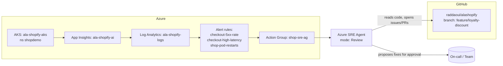

# Azure SRE Agent — Setup & Operations Guide

A step-by-step guide to standing up the **Azure SRE Agent** for the *alashopify*
shop demo: creating the agent in the portal, connecting Azure resources and
source code, onboarding the team, scheduling tasks, and handling an incident.

The agent is set up in **Review mode** (every action needs human approval). Each
section calls out **when and what** you can safely promote to **Autonomous mode**.

> Azure SRE Agent is a preview service. Exact portal labels and available
> regions may change. Where a label may differ, the intent is described so you
> can find the equivalent control.

---

## 0. What you're building

The SRE Agent watches the app's signals (metrics, logs, alerts), investigates
incidents, correlates them with the source code, and **proposes** remediation.
In Review mode a human approves every action; in Autonomous mode the agent can
execute a pre-approved set of action types on its own.

---

## 1. Prerequisites

| Requirement | This demo's value |
|---|---|
| Azure subscription with the SRE Agent preview enabled | *your subscription* |
| Resource group holding the workload | `ala-shopify-rg` (region `westus3`) |
| AKS cluster running the app | `ala-shopify-aks`, namespace `shopdemo` |
| Telemetry: App Insights + Log Analytics | `ala-shopify-ai`, `ala-shopify-logs` |
| Azure Monitor alert rules + action group | `shop-sre-ag` + 3 rules (see §7) |
| Source repo on GitHub | `https://github.com/raddaoui/alashopify` |
| Permissions to grant RBAC roles | **Owner** or **User Access Administrator** on the RG/subscription |
| Microsoft Entra account for each operator | one per team member |

Roles you'll need to *grant* the agent are covered in §3. Roles **you** need to
*do this setup* are Owner / User Access Administrator on `ala-shopify-rg`.

---

## 2. Create the SRE Agent (Azure portal)

1. Sign in to the [Azure portal](https://portal.azure.com).
2. In the global search bar, type **SRE Agent** and select **Azure SRE Agent**.
3. Click **Create**.
4. On the **Basics** tab:
   - **Subscription** — the subscription containing `ala-shopify-rg`.
   - **Resource group** — `ala-shopify-rg` (or a dedicated management RG; the
     agent can monitor across RGs once you grant it access in §3).
   - **Name** — `alashopify-sre-agent`.
   - **Region** — choose a region where the preview is available (co-locating
     with `westus3` keeps latency and data residency simple).
5. **Review + create** → **Create**. When deployment finishes, click
   **Go to resource** — the agent opens the **Setup** screen, which continues in
   §3.

---

## 3. Connect resources (agent setup)

After **Go to resource**, the agent's **Setup** screen lets you choose how much
context to connect:

- **Quickstart** — minimal onboarding for a fast trial.
- **Full setup** — recommended for real investigations (adds more context).

Choose **Full setup**, then connect the sources below. Once setup is done, set
the agent to **Review mode** before doing anything else (see §5).

### 3a. Connect code

Connect your source code repository — **GitHub** or **Azure Repos** — so the
agent can correlate incidents with commits/branches and draft fixes. In the
setup → **Code**, pick your provider, authorize access, and select the
`alashopify` repository.

### 3b. Connect the incident management platform

Connect your incident/alerting source so fired alerts reach the agent:

1. In the setup → **Incidents** (incident management platform).
2. Connect **Azure Monitor alerts** → select the action group `shop-sre-ag`
   (this is how fired alerts reach the agent — see §7).
3. (Optional) Connect an external platform (e.g. PagerDuty/ServiceNow) if that's
   where your on-call incidents originate.

### 3c. Connect Azure resources (read access)

This is where you grant the agent access to your Azure resources and **specify
read-only (Reader)** access for Review mode.

1. In the setup → **Azure resources** → **Add resource groups**.
2. **Select resource groups** → choose `ala-shopify-rg` (the agent can monitor
   across RGs once added).
3. **View agent permissions** → set **Permission level** to:
   - **Reader** — *read-only access. Agent can view resources and metrics but
     cannot make changes.* **Choose this for Review mode.**
   - **Privileged** — read **and** write access (diagnose + perform
     remediation). Don't choose this yet — see §3e and §5.
4. The wizard lists the **roles to be granted** for the level you picked
   (e.g. Reader, Monitoring Reader, Log Analytics Reader). Required roles are
   **granted automatically** when you add the resource group — you don't assign
   them manually.
5. Click **Add resource group**.

### 3d. Connect the telemetry sources

In the agent resource → **Connections** (or **Data sources**):

1. **Add** → **Application Insights** → select `ala-shopify-ai`.
2. **Add** → **Log Analytics workspace** → select `ala-shopify-logs`.
3. **Add** → **Azure Kubernetes Service** → select `ala-shopify-aks`, namespace
   `shopdemo`.

### 3e. Scoped action (write) access — keep minimal in Review mode

In Review mode the agent only *proposes* changes, but the approved action still
executes under the agent's identity, so it needs permission to perform it. Grant
the **narrowest** role for the actions you intend to allow, for example:

| Intended action | Minimal role | Scope |
|---|---|---|
| Restart / scale a deployment | **Azure Kubernetes Service Cluster User Role** + a namespace RBAC `Role` allowing `patch deployments` | `shopdemo` |
| Roll back an image tag | same as above | `shopdemo` |
| Acknowledge/close alerts | **Monitoring Contributor** | `ala-shopify-rg` |

> **Least privilege:** Do **not** grant Contributor on the RG. Add write roles
> only for the action types you actually want the agent to perform.

---

## 4. Team onboarding

Give the on-call team access to the agent and route its notifications to where
they already work.

### 4a. People & roles (Azure RBAC on the agent resource)

Agent resource → **Access control (IAM)** → **Add role assignment**:

| Team role | Azure role on `alashopify-sre-agent` | Can do |
|---|---|---|
| On-call engineer | **SRE Agent Operator** *(or Contributor on the agent)* | View incidents, approve/reject proposed actions |
| Team lead / approver | **SRE Agent Operator** + approver group (§4c) | Approve high-impact actions |
| Observer (PM, support) | **Reader** | View incidents & timelines, no approvals |

Assign by **Microsoft Entra group** (e.g. `shop-oncall`) rather than individuals
so onboarding/offboarding is one membership change.

### 4b. Notifications

In the agent → **Notifications** (and/or via the `shop-sre-ag` action group):

- **Email** — the on-call distribution list.
- **Microsoft Teams** — add the SRE Agent channel connector to your incident
  channel so proposals appear where the team triages.
- Optional: **webhook** to your ITSM/ticketing tool.

### 4c. Approval policy

Define who can approve what (this gates everything in Review mode):

1. Agent → **Policies** → **Approvals**.
2. Create an approver group (e.g. `shop-approvers`) mapped to your Entra group.
3. Require approval for **all action categories** while in Review mode.
4. (Optional) Require **two** approvers for destructive categories (delete,
   scale-to-zero, DB changes).

### 4d. Onboarding checklist (per new team member)

- [ ] Added to the `shop-oncall` Entra group.
- [ ] Can open the agent in the portal and see the incident list.
- [ ] Receives a test notification (trigger via §6 scheduled health check).
- [ ] Has read this guide and the repo runbook
      (`docs/TROUBLESHOOTING.md` in `raddaoui/alashopify`).

---

## 5. Operating modes — Review vs Autonomous

| | **Review mode** (start here) | **Autonomous mode** (promote later) |
|---|---|---|
| Investigation (read logs, metrics, run read-only `kubectl`, query KQL) | ✅ automatic | ✅ automatic |
| Root-cause analysis & written summary | ✅ automatic | ✅ automatic |
| Drafting an issue / fix PR | ✅ draft only | ✅ may open PR automatically |
| Remediation (restart, scale, roll back image) | ⛔ **requires human approval** | ✅ executes pre-approved action types |
| Destructive ops (delete, DB change, scale-to-zero) | ⛔ approval (consider 2) | ⛔ keep manual even in autonomous |

### When to promote an action type to Autonomous

Promote **one narrow action type at a time**, only after it clears this bar:

1. The agent has proposed that action **correctly several times** in Review mode
   (no false root causes, correct target resource).
2. The action is **low-blast-radius and reversible** (e.g. *restart a single
   deployment in `shopdemo`*, *scale a stateless deployment within set bounds*).
3. You've set **guardrails**: max replicas, allowed namespaces (`shopdemo` only),
   rate limits (e.g. no more than 1 auto-restart per 10 min), and a kill switch.
4. There's an **audit trail + rollback** path you've tested.

**Safe-to-automate examples (this demo):**
- Restart a crash-looping pod in `shopdemo`.
- Scale the stateless `gateway`/`orders` deployments within `min=2,max=6`.
- Acknowledge a known, self-resolving alert.

**Keep in Review (never auto) — examples:**
- Rolling back to a different image/commit (changes what code is live).
- Anything touching the `mysql` StatefulSet or its PVC (data loss risk).
- Editing secrets, ConfigMaps, or network/ingress.
- Deleting any resource.

How to change it: Agent → **Settings** → **Mode**, or per-action under
**Policies → Autonomous actions** → enable the specific action type and set its
guardrails. You can revert to full Review at any time with the **kill switch**.

---

## 6. Scheduling a task

Use schedules for proactive checks (not just reactive alerts).

1. Agent → **Tasks** (or **Schedules**) → **New scheduled task**.
2. **Name** — `shopdemo-hourly-health`.
3. **Trigger** — recurrence, e.g. every **1 hour** (cron `0 * * * *`).
4. **Scope** — resource group `ala-shopify-rg`, namespace `shopdemo`.
5. **Instruction / prompt** — what you want it to do, e.g.:

   > "Check the health of the shopdemo namespace. Verify all deployments have
   > their desired replicas Ready, query App Insights for the checkout p95
   > latency and 5xx rate over the last hour, and confirm no pods restarted more
   > than 3 times. If everything is healthy, post a one-line green summary. If
   > not, open an incident, perform root-cause analysis, and **propose** (do not
   > execute) a remediation for approval."

6. **Mode for this task** — **Review** (propose only). Leave autonomous off.
7. **Notifications** — post results to the Teams incident channel.
8. **Save**.

Other useful schedules:
- `nightly-cost-and-drift` — daily: report deployment image/commit drift vs.
  `main` using the `sre-demo.deploy/commit` annotations.
- `pre-demo-readiness` — on-demand button you run before a demo.

> In Review mode a scheduled run that finds a problem will **propose** a fix and
> wait. Promote a schedule to autonomous only for the narrow, reversible actions
> in §5 (e.g. auto-restart a crash-looped pod found by the hourly check).

---

## 7. Handling an incident (end-to-end)

This walks through the demo's injected fault: the checkout path runs a slow DB
query and intermittently throws, producing ~600 ms latency and HTTP 500s.

### 7a. Trigger
One of the alert rules fires and notifies the `shop-sre-ag` action group:

| Alert rule | Condition | Severity |
|---|---|---|
| `checkout-5xx-rate` | checkout returns ≥ 5 HTTP 5xx in 5 min | Sev 1 |
| `checkout-high-latency` | checkout p95 > 800 ms | Sev 2 |
| `shop-pod-restarts` | a `shopdemo` pod restarts > 3× | Sev 2 |

The action group hands the alert to the SRE Agent, which **opens an incident**.

### 7b. What the agent does automatically (Review mode)
1. **Triages** the alert and assembles context: which service, since when, blast
   radius.
2. **Investigates** read-only:
   - Queries App Insights for the slow operation and the exception type.
   - Walks the distributed trace: request → `orders` → MySQL dependency span.
   - Runs read-only `kubectl` (`get pods`, `logs`, `describe`) in `shopdemo`.
3. **Correlates with code**: reads the `sre-demo.deploy/branch` +
   `sre-demo.deploy/commit` annotations on the `orders` deployment, maps them to
   the GitHub commit, and identifies the changed code on that branch.
4. **Writes a root-cause analysis** with evidence (timestamps, the dominant
   span, the failing query/exception, the suspect commit).

### 7c. What needs your approval (Review mode)
The agent **proposes** remediation and waits:
- *Immediate mitigation* — e.g. roll back `orders` to the last-known-good
  image/commit, **or** scale out to dilute impact.
- *Durable fix* — a **draft PR** against the suspect branch with the proposed
  code change and a written explanation.

You review the proposal, then **Approve** (agent executes the approved step) or
**Reject** (and optionally tell it what to do instead). Every step is logged.

### 7d. Verification & close
After an approved mitigation the agent re-checks the same signals (5xx rate, p95)
and confirms recovery, then summarizes the timeline and closes the incident.

### 7e. Where to watch it
- **Azure portal → Monitor → Alerts** — the fired alerts.
- **Agent → Incidents** — the live investigation timeline and proposed actions.
- **Teams incident channel** — proposals/approvals in-line.
- **GitHub** `raddaoui/alashopify` — any issue/PR the agent opened.

> **Could this incident be handled autonomously?** The *mitigation* (restart /
> scale within `shopdemo`) is a good autonomous candidate once proven (§5). The
> *rollback to a different commit* and the *code-fix PR merge* should stay in
> Review — they change what code runs in production.

---

## 8. Quick reference

| Item | Value |
|---|---|
| SRE Agent | `alashopify-sre-agent` (Review mode) |
| Resource group / region | `ala-shopify-rg` / `westus3` |
| AKS / namespace | `ala-shopify-aks` / `shopdemo` |
| App Insights | `ala-shopify-ai` |
| Log Analytics | `ala-shopify-logs` |
| Action group | `shop-sre-ag` |
| Alert rules | `checkout-5xx-rate`, `checkout-high-latency`, `shop-pod-restarts` |
| Source repo | `https://github.com/raddaoui/alashopify` |
| Deployed-build annotations | `sre-demo.deploy/branch`, `sre-demo.deploy/commit` |
| On-call group / approvers | `shop-oncall` / `shop-approvers` (Entra groups) |

### Mode summary
- **Default: Review mode** — agent investigates and proposes; humans approve all
  remediation.
- **Promote to Autonomous** only per narrow, reversible, guardrailed action type
  (e.g. restart/scale within `shopdemo`) after it's proven itself in Review.
- **Never autonomous:** rollbacks to a different commit, StatefulSet/DB/PVC
  changes, secret/config edits, deletes. Keep the kill switch handy.
